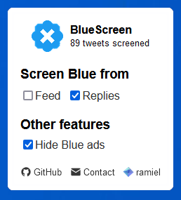

<!-- 

<h1 align="center"> BlueScreen </h1> -->

<h3 align="center">Browser extension which hides Blue verified accounts from your feed and replies.</h3>

 

## Download

<!-- [Firefox](https://addons.mozilla.org/en-US/firefox/addon/blue-screen/)
[Chrome](https://chromewebstore.google.com/detail/bluescreen/nogankkoicghipdhohicocdeajcpndao) -->

## Example

## Privacy: 

No data is collected/shared.

## Changelog:

### 1.0.6
- Changed default settings to hide all verified accounts & ads
- Will now show replies by the original poster, even if they are verified
- Popup menu now rounds the screened count

### 1.0.5
- Now includes the following as ads;
    - "Subscribe to write longer posts" right sidebar div
    - "Verified Orgs" left nav link
- Added "Screened Tweets" counter to the popup menu
- Moved version number behind "bbb" combo

### 1.0.4
- Added hidden logo change when pressing "bbb" in the popup menu
- Added ad blocking for Twitter Blue ads
- Rearranged popup menu